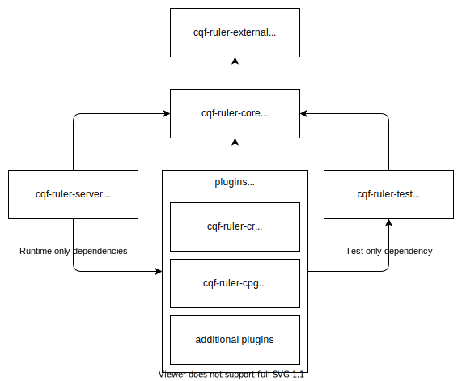

# cqf-ruler

[](https://maven-badges.herokuapp.com/maven-central/org.opencds.cqf/cqf-ruler-r4) [](https://www.travis-ci.com/DBCG/cqf-ruler) [](https://hub.docker.com/r/contentgroup/cqf-ruler/tags) [](https://chat.fhir.org/#narrow/stream/179220-cql)

The CQF Ruler is based on the [HAPI FHIR JPA Server Starter](https://github.com/hapifhir/hapi-fhir-jpaserver-starter) and adds a set of plugins that provide an implementation of FHIR's [Clinical Reasoning Module](
http://hl7.org/fhir/clinicalreasoning-module.html), serve as a
knowledge artifact repository, and a [cds-hooks](https://cds-hooks.org/) compatible clinical decision support service. It does this via integrating a number of other CQL and FHIR-related projects, some of which are listed below.

## Usage

### Docker

The easiest way to get started with the cqf-ruler is to pull and run the docker image

```bash
docker pull contentgroup/cqf-ruler
docker run -p 8080:8080 contentgroup/cqf-ruler
```

This will make the cqf-ruler available on `http://localhost:8080`

Other options for deployment are listed on the [wiki](https://github.com/DBCG/cqf-ruler/wiki) for more documentation.

## Development

### Dependencies

#### Git Submodules

This project includes the `hapi-fhir-jpaserver-starter` project as a submodule and includes the compiled classes as a jar called `cqf-ruler-external`. Be sure to use the following command when cloning this repository to ensure the submodules are initialized correctly:

`git clone --recurse-submodules https://github.com/DBCG/cqf-ruler.git`

or if you've already checked out the repo, use

`git submodule update --init --recursive`

#### Java

Go to [http://www.oracle.com/technetwork/java/javase/downloads/](
http://www.oracle.com/technetwork/java/javase/downloads/) and download the
latest (version 11 or higher) JDK for your platform, and install it.

#### Apache Maven

This project uses the [Maven wrapper](https://github.com/apache/maven-wrapper) to ensure the correct verison of Maven is available on your machine. Use `./mvnw` to invoke it.

### Build

`./mvnw package`

Visit the [wiki](https://github.com/DBCG/cqf-ruler/wiki) for more documentation.

### Run

To run the cqf-ruler directory from this project use:

`java -jar server/target/cqf-ruler-server-*.war`

### Module Structure

The cqf-ruler uses the hapi-fhir-jpaserver-starter project as a base. On top of that, it adds an extensiblity API and utility functions to allow creating plugins which contain functionality for a specific IG. This diagram shows how it's structured



### Plugins

Plugins use Spring Boot [autoconfiguration](https://docs.spring.io/spring-boot/docs/2.0.0.M3/reference/html/boot-features-developing-auto-configuration.html) to be loaded at runtime. Spring searches for a `spring.factories` file in the meta-data of the jars on the classpath, and the `spring.factories` file points to the root Spring config for the plugin. For example, the content of the `resources/META-INF/spring.factories` file might be:

```ini
org.springframework.boot.autoconfigure.EnableAutoConfiguration=\
org.opencds.cqf.ruler.example.ExampleConfig
```

Any Beans defined in that root plugin config that implement one the cqf-ruler plugin apis will be loaded by the cqf-ruler on startup. There's a full plugin example [here](plugin/hello-world).

Plugins should reference the `cqf-ruler-core` project using the `provided` scope. This tells Maven that the `cqf-ruler-core` classes will be available at runtime, and not to include those dependencies in the plugin jar.

```xml
<dependency>
    <groupId>org.opencds.cqf.ruler</groupId>
    <artifactId>cqf-ruler-core</artifactId>
    <version>0.5.0-SNAPSHOT</version>
    <scope>provided</scope>
</dependency>
```

Any other dependencies also required by the base `cqf-ruler-core` may also be listed in `provided` scope

#### Plugin API

Currently the cqf-ruler recognizes three types of plugin contributions:

* Operation Providers
  * Provide implementation of some FHIR operation
* Metadata Extenders
  * Mutates the conformance/capability statements
* Interceptors
  * Modify requests/responses

#### Plugin Limitations

The plugin system is very simple and naive. Plugins are expected to be well-behaved, and not contribute any beans that may be invalid for the current server's configuration. This includes but is not limited to, multiple versions of plugins, mismatched FHIR versions, operation overrides, etc.

## Coding Conventions

The CQF Project has adopted an over-arching goal to contribute back to HAPI.
To this end:

* The CQF Ruler project has adopted the HAPI Coding Conventions: <https://github.com/hapifhir/hapi-fhir/wiki/Contributing>
* Plugins should generally use the "hapi.fhir" prefix for configuration properties

### Utility Guidelines

#### Types of Utilities

In general, reusable utilities are separated along two different dimensions, Classes and Behaviors.

Class specific utilities are functions that are associated with specific class or interface, and add functionality to that class.

Behavior specific utilities allow the reuse of behavior across many different classes.

#### Class Specific Utilities

Utility or Helper methods that are associated with a single class should go into a class that has the pluralized name of the associated class. For example, utilities for `Client` should go into the `Clients` class. This ensures that the utility class is focused on one class and allows for more readable code:

`Clients.forUrl("test.com")`

as opposed to:

`ClientUtilities.createClient("test.com")`

or, if you put unrelated code into the class, you might end up with something like:

`Clients.parseRegex()`

If the code doesn't read clearly after you've added an utility, consider that it may not be in the right place.

In general, all the functions for this type of utility should be `static`. No internal state should be maintained (`static final`, or immutable, state is ok). If you final that your utility class contains mutable state, consider an alternate design.

Examples

* Factory functions
* Adding behavior to a class you can't extend

#### Behavior Specific Utilities

If there is behavior you'd like to share across many classes, model that as an interface and use a name that follows the pattern `"ThingDoer"`. For example, all the classes that access a database might be `DatabaseReader`. Use `default` interface implementations to write logic that can be shared many places. The interfaces themselves shouldn't have mutable state (again `static final` is ok). If it's necessary for the for shared logic to have access to state, model that as an method without a default implementation. For example:

```java
interface DatabaseReader {
   Database getDb();
   default Entity read(Id id) {
      return getDb().connect().find(id);
   }
}
```

In the above example any class that has access to a `Database` can inherit the `read` behavior.

Examples

* Cross-cutting concerns

### Discovery

Following conventions such as these make it easier for the next developer to find code that's already been implemented as opposed to reinventing the wheel.

## Commit Policy

All new development takes place on `<feature>` branches off `master`. Once feature development on the branch is complete, the feature branch is submitted to `master` as a PR. The PR is reviewed by maintainers and regression testing by the CI build occurs.

Changes to the `master` branch must be done through an approved PR. Delete branches after merging to keep the repository clean.

Merges to `master` trigger a deployment to the Maven Snapshots repositories. Once ready for a release, the `master` branch is updated with the correct version number and is tagged. Tags trigger a full release to Maven Central and a corresponding release to Github. Releases SHALL NOT have a SNAPSHOT version, nor any SNAPSHOT dependencies.

## Release Process

To release a new version of CQF Ruler:

* [ ] Ensure target versions/releases of:
  * [ ] HAPI
  * [ ] CQFTooling
  * [ ] CDSHooks
* [ ] Update master to be a release (i.e. no SNAPSHOT) version
  * [ ] Regression test each of the operations of all the plugins
* [ ] Passed Travis Build for release profile
* [ ] Create a Github Release (which creates a tag at the current commit of master)
  * [ ] Choose the "Auto-generate release notes" option
* Travis does the release to Maven, ensure binaries are published to the binaries repository:
  * [ ]  server: (<https://oss.sonatype.org/#view-repositories;public~browsestorage~org/opencds/cqf/cqf-ruler-server>)
* Travis does the release of the image to DockerHub
  * [ ] Ensure the image is published to DockerHub (<https://hub.docker.com/r/contentgroup/cqf-ruler>)
* [ ] Update master to vNext-SNAPSHOT
* [ ] Ensure all issues included in the release are Closed

## Getting Help

Additional documentation is on the [wiki](https://github.com/DBCG/cqf-ruler/wiki).

Bugs and feature requests can be filed with [Github Issues](https://github.com/cqframework/cqf-ruler/issues).

The implementers are active on the official FHIR [Zulip chat for CQL](https://chat.fhir.org/#narrow/stream/179220-cql).

Inquires for commercial support can be directed to [info@alphora.com](info@alphora.com).

## Related Projects

[HAPI FHIR](https://github.com/hapifhir) - Provides the FHIR API and server upon which the cqf-ruler is built.

[Clinical Quality Language](https://github.com/cqframework/clinical_quality_language) - Tooling in support of the CQL specification, including the CQL verifier/translator used in this project.

[CQL Evaluator](https://github.com/DBCG/cql-evaluator) - Provides the CQL execution environment used by the cqf-ruler.

[CQF Tooling](https://github.com/cqframework/cqf-tooling) - Provides several operations that the cqf-ruler exposes are services, such as $refresh-generated content.

[CQL Support for Atom](https://atom.io/packages/language-cql) - Open source CQL IDE with syntax highlighting, linting, and local CQL evaluation.

## License

Copyright 2019+ Dynamic Content Group, LLC (dba Alphora)

Licensed under the Apache License, Version 2.0 (the "License");
you may not use this file except in compliance with the License.
You may obtain a copy of the License at

[http://www.apache.org/licenses/LICENSE-2.0](http://www.apache.org/licenses/LICENSE-2.0)

Unless required by applicable law or agreed to in writing, software
distributed under the License is distributed on an "AS IS" BASIS,
WITHOUT WARRANTIES OR CONDITIONS OF ANY KIND, either express or implied.
See the License for the specific language governing permissions and
limitations under the License.
